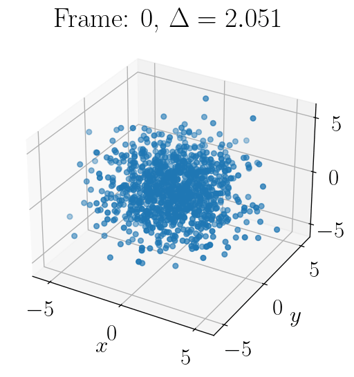

# Metropolis algorithm

  

# Topological Data Analysis

  

# Python workflow "cheatsheet"
- delete last git stash: `git stash drop`
- remove old jupyter kernels: `jupyter kernelspec uninstall unwanted-kernel`
- pull all data from all submodules: `git submodule update --init --recursive`
- remove a conda environment completely: `conda remove --name myenv --all`
- new submodule: `git submodule add <https_url>`
- update all submodules: `git submodule update --remote --merge`, then commit the new gitlink
- list all jupyter kernels: `jupyter kernelspec list`
- install a new jupyter kernel for a python interpreter in a conda env `python -m ipykernel install --user --name=<CONDA ENV NAME> --display-name="$(python --version): <PRETTY NAME>"`
